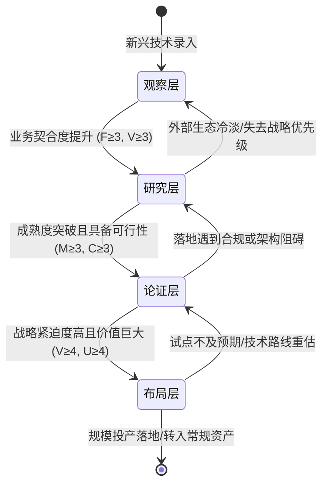
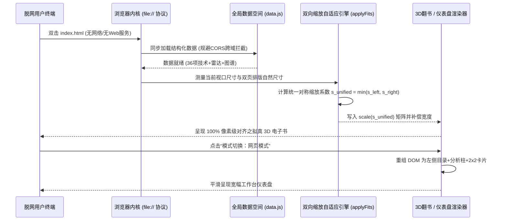

# 专利申报图纸与说明书附图汇编

本文件汇总整理本项目在申报**发明专利**与**外观设计专利（GUI）**过程中所需的全部说明书附图方案、架构流程图、算法逻辑图及界面状态图设计指南。

---

## 第一部分：发明专利 1 说明书附图（研判系统与动态流转）

### 图 1：金融前沿技术量化研判系统总体模块结构图
```mermaid
graph TD
    A[待研判前沿技术数据输入] --> B[六维正交指标特征抽取模块]
    B --> C[六维量化向量构建 S(Ti)]
    C --> D{四层梯队有限状态机判定引擎}
    D -->|匹配度≥4 且 价值≥4 且 紧迫度高| E[布局层: 资源前置·沙盒试点]
    D -->|成熟度3~4 且 可行度≥3 且 业务相关| F[论证层: PoC验证·架构融合]
    D -->|趋势明确 且 机理待验| G[研究层: 原型试制·论文专利监控]
    D -->|早期萌芽/强外部约束| H[观察层: 常态跟踪·拐点捕捉]
    C --> I[六维矢量蜘蛛雷达图渲染模块]
    C --> J[三次贝塞尔 Hype Cycle 拟合映射]
    C --> K[5维度×5圈层极坐标影响雷达映射]
    E & F & G & H --> L[企业架构十大中心落位拓扑联动]
```

### 图 2：四层梯队有限状态机（FSM）动态流转状态转换图


### 图 3：三次贝塞尔参数曲线拟合技术成熟度曲线数学模型图
- **横轴**：生命周期演进阶段（时间 / 成熟度）$x \in [50, 975]$
- **纵轴**：期望值与产业关注度 $y \in [42, 500]$
- **数学方程**：
  $$B(t) = (1-t)^3 P_0 + 3(1-t)^2 t P_1 + 3(1-t) t^2 P_2 + t^3 P_3$$
- **分段控制点**：
  - 第一段（萌芽期至波峰）：$P_0(60, 460) \to P_1(143, 450) \to P_2(226, 65) \to P_3(310, 65)$
  - 第二段（波峰至谷底）：$P_0(310, 65) \to P_1(375, 65) \to P_2(440, 450) \to P_3(505, 450)$
  - 第三段（谷底爬升至成熟）：$P_0(505, 450) \to P_1(610, 450) \to P_2(715, 270) \to P_3(820, 268)$

---

## 第二部分：发明专利 2 说明书附图（脱网自适应双模渲染）

### 图 4：脱网零依赖自包含渲染与双模态切换架构图


### 图 5：纸张物理书脊厚度随阅读进度动态演算示意图
```
【翻开全书第 1 跨页 (靠近封面)】             【翻开全书正中跨页 (中间部分)】              【翻开全书最后跨页 (靠近封底)】
┌─────────────────────────────────┐        ┌─────────────────────────────────┐         ┌─────────────────────────────────┐
│ [左书脊: 0px]     [右书脊: 13px]│        │ [左书脊: 7px]      [右书脊: 6px]│         │ [左书脊: 13px]     [右书脊: 0px]│
│ ┌──────────────┬──────────────┐ │        │ ┌──────────────┬──────────────┐ │         │ ┌──────────────┬──────────────┐ │
│ │              │              │ │        │ │              │              │ │         │ │              │              │ │
│ │  封面后衬页  │   第一章目录 │█│        │█│   T15 专题   │   T16 专题   │█│         │█│  附录二术语  │   编委会封底 │ │
│ │              │              │█│        │█│              │              │█│         │█│              │              │ │
│ └──────────────┴──────────────┘█│        │█└──────────────┴──────────────┘█│         │█└──────────────┴──────────────┘ │
└─────────────────────────────────┘        └─────────────────────────────────┘         └─────────────────────────────────┘
* 注：深色阴影条 █ 代表书边多层阶梯厚度，随进度比率 ratio = spread / maxSpread 实时动态递增/递减。
```

---

## 第三部分：发明专利 3 说明书附图（术语长词优先智能超链解析）

### 图 6：DOM 树非破坏性遍历与长词优先分词注入流程图
```mermaid
flowchart TD
    Start([开始文档加载]) --> InitDict[构建专业术语词典库]
    InitDict --> SortTerms[按字符串长度降序排列 terms.sort]
    SortTerms --> CompileRegex[编译全局词边界正则 masterRegex = \b term1|term2... \b]
    CompileRegex --> CreateWalker[调用 document.createTreeWalker 遍历容器]
    CreateWalker --> FilterNode{节点过滤判定<br/>acceptNode}
    FilterNode -->|父级为 script/style/svg/input 或 已包含超链| RejectNode[拒绝跳过该节点]
    FilterNode -->|纯文本节点 TextNode| AcceptNode[接受并进入正则扫描]
    AcceptNode --> ScanRegex{正则扫描是否命中?}
    ScanRegex -->|未命中| NextNode[移动至下一节点]
    ScanRegex -->|命中术语| SliceText[利用 DocumentFragment 切片重组]
    SliceText --> BuildSpan[将术语切片转为 span.term-ref]
    BuildSpan --> Replace[node.parentNode.replaceChild fragment, node]
    Replace --> CheckMore[检查该文本是否还有其他匹配]
    CheckMore --> NextNode
    NextNode --> End([遍历完成，事件监听 100% 保持完好])
```

---

## 第四部分：外观设计专利（GUI）状态图版面构图蓝图

### 构图 1：主视图（书籍模式封面闭合态构图）
```
┌──────────────────────────────────────────────────────────────────────────────┐
│ [研] 科技发展部前沿技术研究成果集    [🔍 全局搜索前沿技术/术语...]    [📖书籍] [🌙] [v专利演示]│
├──────────────────────────────────────────────────────────────────────────────┤
│                                                                              │
│                         ┌──────────────────────────┐                         │
│                         │   BANK FINTECH RESEARCH  │                         │
│                         │                          │                         │
│                         │ 科技发展部前沿技术研究成果集│                         │
│                         │ ──────────────────────── │                         │
│                         │       科技规划处 编制     │                         │
│                         │          2026 年         │                         │
│                         └──────────────────────────┘                         │
│                                                                              │
│                       ◄ 点击任意位置或使用左右键翻阅 ►                        │
└──────────────────────────────────────────────────────────────────────────────┘
```

### 构图 2：变化状态图 1（书籍模式双页对开正文阅读构图）
```
┌──────────────────────────────────────────────────────────────────────────────┐
│ [研] 科技发展部前沿技术研究成果集    [🔍 搜索...]           [📖书籍] [🌙] [v专利演示]│
├─┬──────────────────────────────────┬──┬──────────────────────────────────┬─┤
│ │ 【左页：量化研判与结论建议】     │中│ 【右页：深度剖析与价值洞察】     │ │
│ │ T01 自主型AI智能体 [人工智能][布局]│缝│ 💡 技术定义与机理                │ │
│ │ ──────────────────────────────── │阴│    自主规划、工具调用、长期记忆...│ │
│ │ 🕸️ 六维研判蜘蛛图                │影│ 🚀 颠覆性趋势演进                │ │
│ │   [大号正六边形雷达] 5分         │  │    从对话式Copilot向自治Agent跃迁 │ │
│ │ ⚖️ 研判结论与处置建议            │  │ 🏦 对银行的价值贡献              │ │
│ │   重点提前布局，开展沙盒试点攻坚 │  │    信贷自动化审批、全天候代码自愈 │ │
│ │   [成熟3][匹配5][价值5][可行4]...│  │ ⚠️ 当前局限性与合规风险          │ │
│ │ 🧭 演进背景与动因                │  │    幻觉不可控、责任主体认定困难   │ │
│ │    大模型由被动生成转向主动决策  │  │                              [◢] │ │
├─┴──────────────────────────────────┴──┴──────────────────────────────────┴─┤
│ [左侧已读阶梯书签]    ◄ 第 17 页 / 共 55 页 · T01 自主型AI智能体 ►     [右侧待读阶梯书签] │
└──────────────────────────────────────────────────────────────────────────────┘
```

### 构图 3：变化状态图 3（网页模式宽屏工作台仪表盘构图）
```
┌──────────────────────────────────────────────────────────────────────────────┐
│ [研] 科技发展部前沿技术研究成果集    [🔍 搜索...]           [🌐网页] [🌙] [v专利演示]│
├─────────────┬────────────────────────────────────────────────────────────────┤
│ 📑 目录索引 │ T01 自主型AI智能体  [人工智能] [布局层] [提前布局]   [📄 专题档案] │
│ ─────────── ├───────────────────┬────────────────────────────────────────────┤
│ 封面        │ 🕸️ 六维研判蜘蛛图 │ 💡 技术定义与机理   │ 🚀 颠覆性趋势演进    │
│ 序章        │   [雷达蜘蛛图]    │    核心由规划器、   │    单体智能向群体协同│
│ 第一章 方法 │                   │    工具集与环境感知 │    演进，打破人工断点│
│ 第二章 成果 │ 成熟度: 3.8/5     ├───────────────────┼────────────────────┤
│ 第三章 技术 │ 战略匹配: 4.8/5   │ 🏦 对银行的价值贡献 │ ⚠️ 局限性与合规风险 │
│  ► T01 智能体│ 价值贡献: 4.9/5   │    端到端业务闭环， │    金融级确定性缺陷，│
│    T02 原生 │ 引入可行: 3.5/5   │    风控智能反洗钱   │    数据隐私出境风险  │
│    T03 事件 │ 战略紧迫: 4.6/5   │                   │                    │
│    T04 WASM │ 处置: 提前布局    │                   │                    │
└─────────────┴───────────────────┴───────────────────┴────────────────────┘
```
